# Frequency Estimation under the Strict Turnstile Model with α-Bounded Deletions

## 1. Introduction

This project studies frequency estimation in **strict turnstile streams** under the **α-bounded deletion** condition. All updates have unit weight, every prefix remains nonnegative for every item, and the final stream satisfies

\[
I + D \le \alpha F_1,
\]

where `I` is the total number of insertions, `D` is the total number of deletions, and `F1` is the final `L1` norm of the frequency vector. Under this constraint, the goal is to compare different sketch and summary methods in terms of point-query accuracy and space usage.

The implemented algorithms are:

- `Double-MG`
- `Double-SS`
- `Count-Min Sketch`
- `Count-Sketch`
- `Integrated SpaceSaving±` as the advanced design candidate

The final evaluation is organized around four groups of results:

1. Fixed `epsilon`
   - error and space as `alpha` varies
   - error and space as `stream length` varies
2. Results as `epsilon` varies
3. Results as `logical space` varies
4. Fixed logical space
   - error as `alpha` varies
   - error as `stream length` varies

All main figures use three subplots ordered as `Kosarak`, `Zipf`, and `Uniform`, so dataset effects are already reflected in the main plots rather than separated into an extra section.

## 2. Algorithms and Theoretical Analysis

This section states the main theoretical conclusions for each method under the strict turnstile and α-bounded deletion setting, and explains the trends we should expect in the experiments.

### 2.1 Double-MG

`Double-MG` splits the problem into two insertion-only subproblems:

- one `Misra-Gries` summary for all `+1` updates;
- one `Misra-Gries` summary for all `-1` updates.

If the two summaries use `m_I` and `m_D` counters, then by the standard `Misra-Gries` guarantee,

\[
\hat f_e = \hat f_e^{(+)} - \hat f_e^{(-)},
\]

\[
f_e^{(+)} - \hat f_e^{(+)} \le \frac{I}{m_I}, \qquad
f_e^{(-)} - \hat f_e^{(-)} \le \frac{D}{m_D}.
\]

Hence the point-query error satisfies

\[
|\hat f_e - f_e|
\le
\frac{I}{m_I} + \frac{D}{m_D}.
\]

Under the symmetric choice `m_I = m_D = k/2`,

\[
|\hat f_e - f_e|
\le
\frac{2(I + D)}{k}
\le
\frac{2\alpha F_1}{k}.
\]

Therefore, to achieve additive error on the order of `\epsilon F_1`, we need

\[
k = O(\alpha / \epsilon),
\]

that is, `O(alpha / epsilon)` space. This implies that the required space grows linearly with `alpha`, and also suggests that `Double-MG` should work especially well when the stream schedule is close to “all insertions first, all deletions later.”

### 2.2 Double-SS

`Double-SS` has the same structure as `Double-MG`, but uses `Space-Saving` instead of `Misra-Gries`. If the positive and negative streams use `m_I` and `m_D` counters, then its point-query error can also be written as

\[
|\hat f_e - f_e|
\le
\frac{I}{m_I} + \frac{D}{m_D}.
\]

With `m_I = m_D = k/2`,

\[
|\hat f_e - f_e|
\le
\frac{2(I + D)}{k}
\le
\frac{2\alpha F_1}{k}.
\]

So `Double-SS` also has

\[
O(\alpha / \epsilon)
\]

space complexity at the asymptotic level. The key difference is that `Space-Saving` is one-sided overestimating on each stream, and these biases do not necessarily cancel after subtraction. As a result, its practical constant can be worse than that of `Double-MG`.

### 2.3 Integrated SpaceSaving±

`Integrated SpaceSaving±` keeps only one summary. For each monitored item, it stores both insertion and deletion counts and processes positive and negative updates within the same structure. Its theoretical appeal is that one summary may achieve a better constant than two separate summaries.

Suppose the summary uses `m` counters. The error scale can be written as

\[
\frac{I}{m}
\le
\frac{\alpha + 1}{2m} F_1,
\]

using the relations

\[
I - D = F_1, \qquad I + D \le \alpha F_1.
\]

From these, we obtain

\[
I \le \frac{\alpha + 1}{2} F_1,
\qquad
D \le \frac{\alpha - 1}{2} F_1.
\]

Therefore `Integrated SpaceSaving±` also needs only

\[
O(\alpha / \epsilon)
\]

space to reach error on the order of `\epsilon F_1`, and may in principle have a better constant than the two-summary design. This is why it is the most important advanced-design candidate in the project.

### 2.4 Count-Min Sketch

`Count-Min Sketch` naturally supports turnstile updates. Under strict turnstile updates, it still satisfies the classical point-query guarantee

\[
f_e \le \hat f_e \le f_e + \epsilon F_1
\]

with high probability, using

\[
O\!\left(\frac{1}{\epsilon}\log\frac{1}{\delta}\right)
\]

space. The important point is that the main bound is controlled by `\epsilon` and `\delta`, not by `alpha`. In other words, bounded deletion does not directly improve the standard point-query bound of `Count-Min`. So if the sketch size is fixed, changing `alpha` should not create a strong systematic improvement.

### 2.5 Count-Sketch

`Count-Sketch` is also turnstile-native. Its estimator is unbiased, and the error is mainly controlled by `F2` or tail-`F2`. A typical form is

\[
|\hat f_e - f_e|
=
O\!\left(\sqrt{\frac{F_2}{w}}\right),
\]

where `w` is the width of each hash table. Its total space is typically

\[
O\!\left(\frac{1}{\epsilon^2}\log\frac{1}{\delta}\right).
\]

As with `Count-Min`, bounded deletion does not automatically improve its main theoretical bound. Its advantage comes instead from native turnstile support and cancellation of positive and negative collision noise. Therefore, when the sketch is large and the data is skewed, `Count-Sketch` is expected to be a very strong baseline.

## 3. Experimental Setup

### 3.1 Datasets

We use three datasets:

- **Uniform synthetic**
- **Zipf synthetic** with fixed parameter `s = 1.2`
- **Kosarak** click-stream data as the real dataset

Here `uniform` serves as the balanced synthetic dataset, `zipf` as the skewed synthetic dataset, and `kosarak` as the required real-world dataset.

### 3.2 Stream Construction

All experiments use unit updates:

- `(item, +1)` for insertion
- `(item, -1)` for deletion

The final experiments use **non-interleaved random deletion**:

1. generate the full insertion sequence,
2. sample deletions uniformly from previously inserted occurrences,
3. append all deletions at the end.

This construction is the easiest way to guarantee strict-turnstile legality, and it matches the final experiment pipeline.

### 3.3 Parameters

The main experiment grid is:

- `F1* in {5e4, 1e5, 2e5, 5e5}`
- `alpha in {1.5, 2, 3, 4, 6, 8}`

The supplementary settings are:

- `epsilon in {0.01, 0.05, 0.1}`
- logical size budget `L in {300, 600, 1200, 2400}`

The actual stream length is

\[
\text{stream length} = I + D.
\]

### 3.4 Metrics

The report mainly uses:

- **Average normalized absolute error**
  - `avg |f_hat - f| / F1`
- **Average relative error**
  - `avg |f_hat - f| / max(f, 1)`
- **Logical size**
  - the number of logical counters or cells used by the sketch/summary

## 4. Main Results under Fixed `epsilon`

The baseline uses the default implementation parameters. In particular, the sketch-based methods use `epsilon = 0.01`. This section corresponds to the two required main experiments under fixed `epsilon`: varying `alpha`, and varying `stream length`.

### 4.1 Error and Space as `alpha` Varies

The corresponding figures are:

- 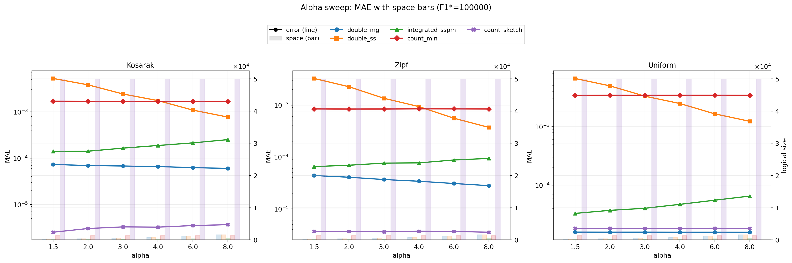
- 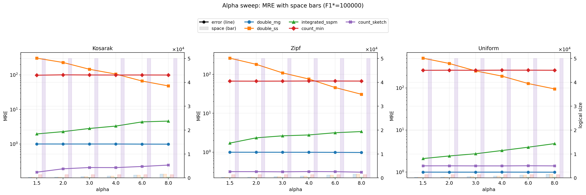

In these plots, the line shows error and the bars show logical size. The three columns correspond to `Kosarak`, `Zipf`, and `Uniform`.

Averaged over the full baseline grid and all three datasets, we obtain:

| Algorithm | Avg. normalized abs. error | Avg. relative error | Avg. logical size |
| --- | ---: | ---: | ---: |
| Count-Sketch | `8.0e-06` | `0.94` | `50000` |
| Double-MG | `3.6e-05` | `1.00` | `815` |
| Integrated SpaceSaving± | `9.5e-05` | `3.13` | `254` |
| Count-Min | `2.0e-03` | `213.66` | `1360` |
| Double-SS | `2.46e-03` | `274.99` | `817` |

The alpha-sweep plots show several stable patterns:

- `Count-Sketch` and `Count-Min` are almost flat as `alpha` changes.
  - This matches theory, since their space is driven by `epsilon` and `delta`, not directly by `alpha`.
- `Double-MG` improves slightly as `alpha` increases.
  - In the current implementation, its capacity increases with `alpha`, so larger churn also gives it more summary space.
- `Double-SS` also improves, but remains much worse than `Double-MG`.
- `Integrated SpaceSaving±` behaves differently from the theoretical intuition.
  - Even though its capacity also increases, its error often gets worse as `alpha` grows.

Comparing the three subplot columns also reveals two consistent dataset effects:

- on `Zipf` and `Kosarak`, `Count-Sketch` has the clearest advantage;
- on `Uniform`, `Double-MG` is often more competitive in normalized absolute error.

So the skew level of the data matters, but the most stable summary-based method is still `Double-MG`.

### 4.2 Error and Space as `stream length` Varies

The corresponding figures are:

- 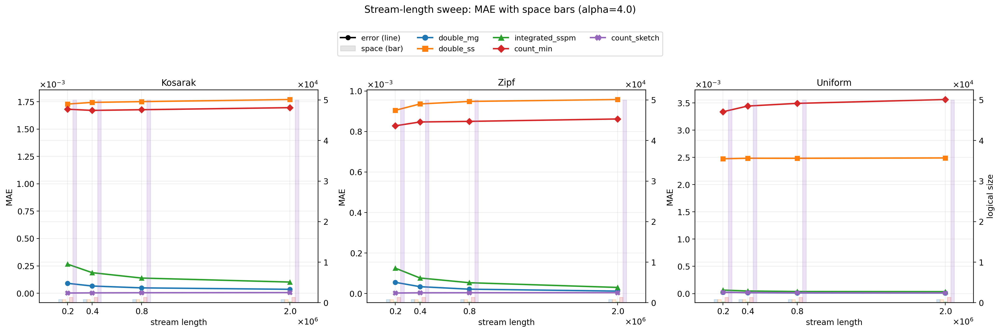
- 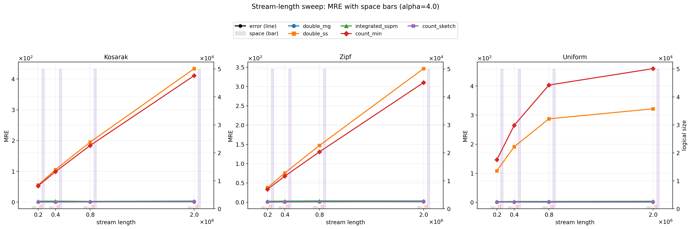

These plots fix `alpha = 4` and change stream length through the `F1*` grid.

The main observations are:

- `Count-Sketch` remains very stable on all three datasets;
- `Count-Min` remains weak and does not improve much as the stream becomes longer;
- `Double-MG` improves steadily as stream length increases;
- `Integrated SpaceSaving±` also improves, but usually less than `Double-MG`;
- `Double-SS` stays substantially worse than `Double-MG` even on longer streams.

This trend is reasonable. As the final mass `F1*` increases, truly frequent items become more stable, which helps summary-based methods. By contrast, `Count-Sketch` already operates with a large enough baseline sketch that its error is close to saturation.

## 5. Results as `epsilon` Varies

This experiment fixes `alpha = 4` and `F1* = 100000`, and varies only `epsilon`.

The corresponding figures are:

- 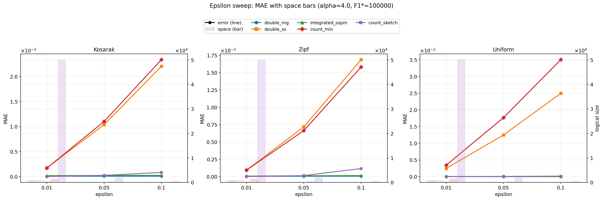
- 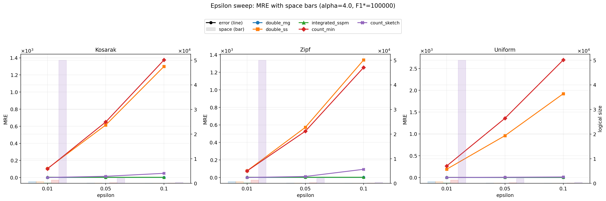

Averaging over the three datasets, the representative normalized-error results are:

| Algorithm | `epsilon=0.01` | `epsilon=0.05` | `epsilon=0.10` |
| --- | ---: | ---: | ---: |
| Double-MG | `3.9e-05` | `4.8e-05` | `5.2e-05` |
| Integrated SpaceSaving± | `1.04e-04` | `1.34e-04` | `1.45e-04` |
| Count-Sketch | `8.0e-06` | `1.59e-04` | `7.19e-04` |
| Count-Min | `2.03e-03` | `1.18e-02` | `2.48e-02` |
| Double-SS | `1.72e-03` | `1.00e-02` | `2.13e-02` |

The main patterns are:

- all methods degrade as `epsilon` increases because the data structures get smaller;
- `Count-Sketch` is extremely strong at `epsilon = 0.01`, but it also degrades the fastest when the sketch is reduced;
- `Double-MG` and `Integrated SpaceSaving±` degrade more smoothly;
- `Count-Min` and `Double-SS` remain clearly weaker across the whole sweep.

This experiment shows why the default baseline can overstate the advantage of `Count-Sketch`: at `epsilon = 0.01`, it is simply using a much larger sketch.

## 6. Results as `Logical Space` Varies

This experiment fixes `alpha = 4` and `F1* = 100000`, and directly compares error under different logical-space budgets.

The corresponding figures are:

- 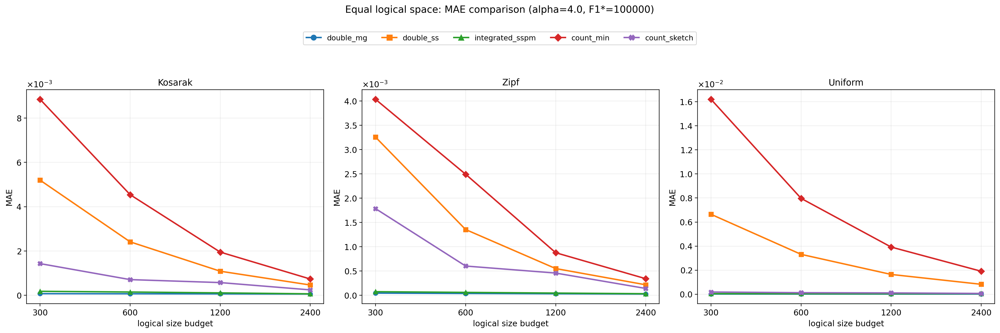
- 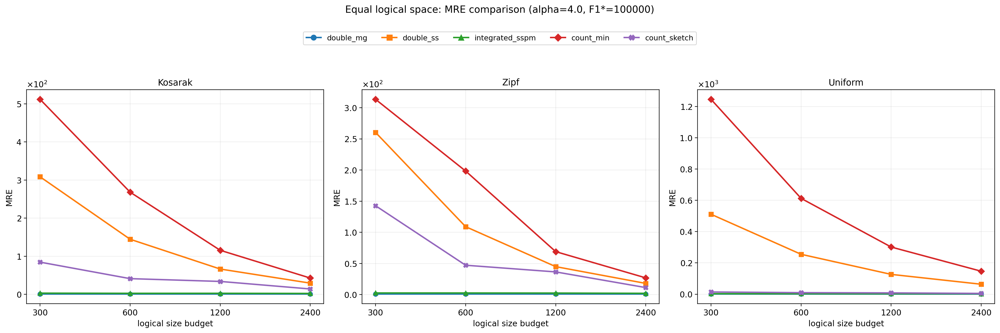

The horizontal axis is the logical size budget, displayed on a log scale. The three subplot columns again correspond to `Kosarak`, `Zipf`, and `Uniform`.

At `alpha = 4` and `F1* = 100000`, the averages across the three datasets are:

### Budget `L = 1200`

| Algorithm | Avg. normalized abs. error | Avg. relative error |
| --- | ---: | ---: |
| Double-MG | `3.6e-05` | `0.99` |
| Integrated SpaceSaving± | `6.6e-05` | `2.86` |
| Count-Sketch | `3.79e-04` | `26.25` |
| Double-SS | `1.09e-03` | `79.38` |
| Count-Min | `2.25e-03` | `162.08` |

### Budget `L = 2400`

| Algorithm | Avg. normalized abs. error | Avg. relative error |
| --- | ---: | ---: |
| Double-MG | `3.2e-05` | `0.99` |
| Integrated SpaceSaving± | `4.7e-05` | `2.59` |
| Count-Sketch | `1.49e-04` | `10.15` |
| Double-SS | `5.01e-04` | `37.05` |
| Count-Min | `9.94e-04` | `72.19` |

This is the fairest comparison in the whole project, and the conclusion is clear:

- once logical space is aligned, `Count-Sketch` is no longer the dominant winner;
- `Double-MG` becomes the strongest point-query method;
- `Integrated SpaceSaving±` is consistently the second tier and gets closer to `Double-MG` as the budget grows;
- `Count-Min` and `Double-SS` remain clearly behind.

So the baseline lead of `Count-Sketch` comes not only from the algorithm itself, but also from its much larger sketch.

## 7. Results under Fixed Logical Space

This section corresponds to the last required experiment group: after fixing the logical budget, compare error as `alpha` varies and as `stream length` varies.

### 7.1 Error as `alpha` Varies under Fixed Logical Space

The corresponding figures are:

- 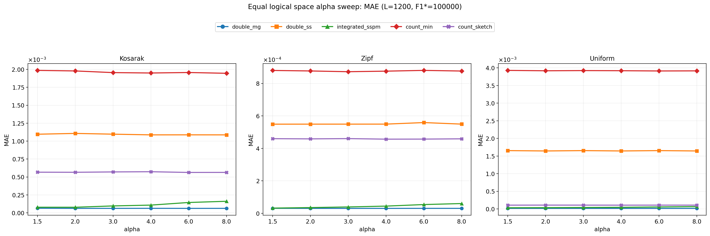
- 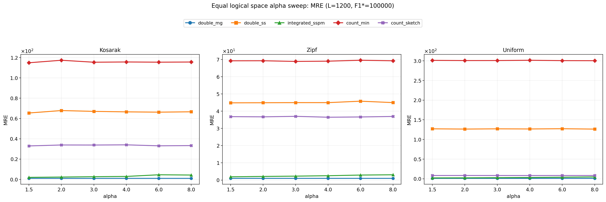

Here we fix `L = 1200` and `F1* = 100000`.

Under the same logical budget, the plots reflect algorithm structure more directly:

- `Double-MG` stays strongest or near-strongest across the full `alpha` range;
- `Integrated SpaceSaving±` is usually second, but still shows degradation at larger `alpha`;
- `Count-Sketch` no longer has the clear lead seen in the baseline;
- `Count-Min` and `Double-SS` remain weak overall.

This shows that bounded-deletion-aware summary methods are genuinely competitive once the comparison is made at equal space.

### 7.2 Error as `stream length` Varies under Fixed Logical Space

The corresponding figures are:

- 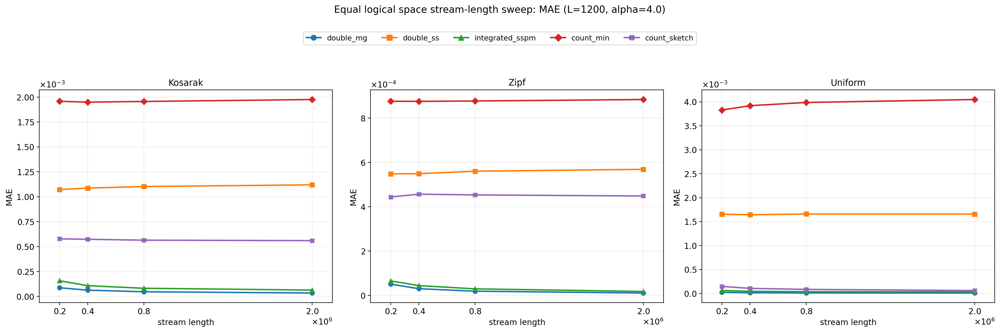
- 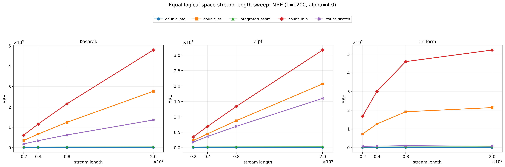

Here we fix `L = 1200` and `alpha = 4`.

The main patterns are:

- `Double-MG` still improves steadily as stream length increases;
- `Integrated SpaceSaving±` also improves, but remains slightly behind `Double-MG`;
- `Count-Sketch` remains stable at small budget, but no longer dominates;
- `Count-Min` and `Double-SS` stay substantially worse.

Therefore, under a fixed-budget view, the most robust conclusion remains that `Double-MG` is the strongest summary-based method in the current implementation, and also stronger than the equal-space sketch baselines for point queries.

## 8. Method-by-Method Discussion

### Double-MG

**Strengths**

- best point-query accuracy among summary-based methods;
- stable across all three datasets;
- very strong under equal-space comparison;
- simple and robust design.

**Weaknesses**

- relative error stays around `1`, which means estimates for many low-frequency items remain coarse;
- for extremely low global error, it can still trail a very large `Count-Sketch`.

### Double-SS

**Strengths**

- follows the same bounded-deletion-aware framework as `Double-MG`;
- improves when the budget grows.

**Weaknesses**

- point-query error is much larger than that of `Double-MG`;
- relative error is very large;
- the bias of two one-sided `Space-Saving` summaries does not cancel well after subtraction.

### Count-Min Sketch

**Strengths**

- clean theory under strict turnstile updates;
- simple implementation and direct parameter interpretation.

**Weaknesses**

- one-sided overestimation hurts low-frequency items badly;
- relative error is very high;
- clearly weaker than `Double-MG` and `Count-Sketch` in this project setting.

### Count-Sketch

**Strengths**

- best point-query accuracy in the baseline;
- especially strong on skewed and real data;
- naturally supports turnstile updates.

**Weaknesses**

- the baseline sketch is much larger than the structures used by other methods;
- once logical space is aligned, its advantage shrinks sharply;
- it also degrades quickly when `epsilon` is increased.

### Integrated SpaceSaving±

**Strengths**

- very compact logical size;
- clearly stronger than `Count-Min` and `Double-SS` on point-query error;
- consistently second tier under equal-space comparison.

**Weaknesses**

- still behind `Double-MG` in the current implementation;
- not robust enough as `alpha` grows;
- the theoretical potential of the one-summary design is not yet fully realized in code.

## 9. Why Does Double-MG Still Beat Integrated SpaceSaving±?

This is one of the most important qualitative conclusions of the project.

In theory, `Integrated SpaceSaving±` is attractive because it may achieve a better constant within the `O(alpha / epsilon)` regime. In practice, however, `Double-MG` still outperforms it consistently. There are three main reasons.

### 9.1 The Current Stream Schedule Favors Double-MG

The formal experiments use a **non-interleaved** schedule: all insertions first, then all deletions. `Double-MG` matches this structure perfectly because it reduces the problem to two insertion-only subproblems:

- one summary for insertions;
- one summary for deletions.

So the stream layout is naturally favorable to `Double-MG`.

### 9.2 Double-MG Receives More Space in the Baseline

Under the default `epsilon` parameterization, `Double-MG` is allocated more logical counters than `Integrated SpaceSaving±`. So part of the baseline gap is simply a space-allocation effect.

However, equal-space results show that this is not the full story. Even at the same budget, `Double-MG` still remains slightly better.

### 9.3 The Current Integrated Version Is Still a Simplified One-Summary Design

The current implementation of `Integrated SpaceSaving±` is still simplified:

- when the summary is full and an unmonitored item receives a deletion, that deletion is ignored;
- eviction and replacement are driven mainly by minimum insertion count rather than a value closer to net frequency;
- stale entries accumulate more easily under heavy churn.

These choices weaken robustness under large deletion pressure. So the correct conclusion is not that the integrated idea fails, but rather that **the current one-summary implementation is not yet strong enough to realize its theoretical potential**.

## 10. Advanced Solution Design

Combining theory and experiments suggests a stronger advanced design: a **hybrid integrated summary + residual sketch**.

The idea is:

1. use an integrated summary to track the main frequent items;
2. maintain a small residual sketch for ignored deletions and eviction residue;
3. drive admission and eviction by an estimate closer to net frequency rather than pure insertion count;
4. answer queries by combining the summary estimate with the residual-sketch estimate.

This directly targets the main weaknesses of the current integrated implementation:

- too many stale entries under high churn;
- some deletions are ignored;
- residual mass outside the summary is not modeled well enough.

Conceptually, this hybrid structure could preserve the compactness of `Integrated SpaceSaving±` while reducing the gap to `Double-MG` and `Count-Sketch`.

## 11. Conclusion

The project leads to five main conclusions.

1. **Under the default baseline, Count-Sketch has the smallest point-query error.** But a substantial part of this advantage comes from using a much larger sketch.
2. **Double-MG is the strongest summary-based method in the current implementation.** Under equal logical space, it is also the strongest point-query method.
3. **Integrated SpaceSaving± is theoretically appealing but does not yet beat Double-MG in practice.** It is compact and competitive under equal space, but the current implementation does not fully exploit the one-summary design.
4. **Equal-space evaluation is necessary.** Looking only at the baseline would overstate the practical advantage of `Count-Sketch`.
5. **Bounded-deletion-aware summary methods are genuinely effective.** Under fixed-budget comparisons, they are fully competitive with turnstile-native sketches, especially `Double-MG`.

Overall, the empirical results are consistent with the theoretical picture:

- `Double-MG` and `Integrated SpaceSaving±` both fit the `O(alpha / epsilon)` framework;
- the main bounds of `Count-Min` and `Count-Sketch` do not automatically improve with `alpha`;
- advanced one-summary designs are promising, but their practical performance depends heavily on deletion handling, eviction rules, and control of residual error.
